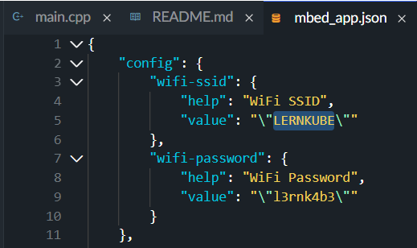
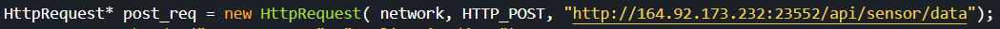
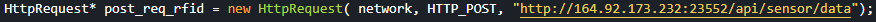

# Documentation Mbedstuff

In this documentation you are going to learn about our idea, how we did it and our thoughts.

## Idea and Flow

The Mbed-Device should send its sensor data (temparature, humidity, button clicks and gyro taps) every second to the ActiveMQ broker.  
The ActiveMQ broker will then forward that data using JMS to the Spring-Boot backend.  
Once the backend has received the data, it will be processed and forwarded to the frontend via a Websocket.  
The frontend can control motor attached to the Mbed-Device. It can also set the text that is displayed on the Mbed's display.  
Once the user has set the desired text for example, the frontend will send an HTTP-Post request to the backend.  
The backend then forwards that request to the broker via JMS which in turn forwards it to the Mbed-Device via MQTT.  

## Sensors

In the end we decided to use 3 sensors and 1 button. Those are:

- DevI2C: Used for the gyro sensor
- HTS221Sensor: Used to measure the temperature and humidity
- DigitalIn: Used to count the presses on button 1
- OLEDDisplay: Used to display the data on the onboard display

### DevI2C
This is a gyro sensor, this can be used to measure many things.
For our program we use this sensor to count the times were rapid movement is committed.

### HTS221Sensor
We use this sensor to get the temerature and the humidity.

### DigitalIn
We use the onboard btn to count the taps.

### OLEDDisplay
The Iotkit also has a display, we use it to show the data we're getting.

### MFRC522
This sensor is used to read the RFID and NFC tags.

## Systems

We use both frontend and backend, even if the frontend isn't that sophisticated.
The Github repo for the back- and frontend can be found here: https://github.com/Leon3131-ux/mbedCloud

### Frontend
The frontend works by connecting to a websocket which is provided by the backend to receive its data.

The following libraries were used to create the frontend:
- [Stomp](https://github.com/stomp-js/stompjs)
- [SockJS](https://github.com/sockjs/sockjs-client)
- [JQuery](https://jquery.com)
- [Bootstrap](https://getbootstrap.com/)
- [ChartJS](https://www.chartjs.org/)

### Backend
The backend is a simple [Spring Boot](https://spring.io/) server.
It receives data via JMS from the ActiveMQ broker. The broker receives data through from the Mbed-Device throughthe following topics:
- `/iotkit/temp`
- `/iotkit/humidity`
- `/iotkit/gyro`
- `/iotkit/button`
- `/iotkit/rfid`
- `/iotkit/display`

When it receives the data, it sends each value out on a corresponding topic of the websocket. The following topics exist:
- `/topic/temp`
- `/topic/humidity`
- `/topic/gyro`
- `/topic/button`
- `/topic/rfid`

It also has an endpoint for getting the display text from the frontend. The endpoint is named `/api/display`

For more information on how data is transferred, please see: [Data](#Data)

The broker that we use is an [ActiveMQ](https://activemq.apache.org/) broker.

## How to use
Our application is easy to use, you just need to clone the repo to mbedstudio and change the mbed_app.json file to your wlan connection.

### Setup mbed and iotkit

1. Change in wifi-ssid the value to your wlan name
2. Change in wifi-password the value to your wlan password.
3. Navigate to http://164.92.173.232:42352/allCharts/allCharts.html and you should see the data of your mbed device being displayed.

If you want to host the back- and frontend for yourself, you will have to change the IP address for the backend accordingly.

and

The instructions on how to host the back- and frontend for yourself are in the corresponding [Repository](https://github.com/Leon3131-ux/mbedCloud)

## Data
There are 5 datapoints we are receiving, those are:

- Temperature, datatype float
- Humidity, datatype float
- Buttonpress count, datatype integer
- Beat gyro sensors count, datatype integer.
- Current RFID and NFC UUID.

The Mbed-Device sends temparature and humidity data once per second to the corresponding topic.The data is formatted as a simple string.

    /iotkit/humidity: 44.5
    
The backend forwards the data in the same way it arrived to the websocket.

When the frontend sets the display text it sends it in the following JSON format:

    {
        "displayText": "whatever"
    }

### Https
In this project we didn't use https, currently this is only running with http.

A reason why we didn't implement this was the time, we wanted to learn how to get data and then pass it, we didn't think
about using a secured connection, but if you want to use this here is how:

To use Https we have to use a certificate to authenticate the connection.

For mbed we have to import a library called https_request.h
    
        #include "https_request.h"

At the end we have to define a certificate, in the documentation it has something like this:

        const char SSL_CA_PEM[] =  "-----BEGIN CERTIFICATE-----\n"
    "MIIDQTCCAimgAwIBAgITBmyfz5m/jAo54vB4ikPmljZbyjANBgkqhkiG9w0BAQsF\n"
    "ADA5MQswCQYDVQQGEwJVUzEPMA0GA1UEChMGQW1hem9uMRkwFwYDVQQDExBBbWF6\n"
    "b24gUm9vdCBDQSAxMB4XDTE1MDUyNjAwMDAwMFoXDTM4MDExNzAwMDAwMFowOTEL\n"
    "MAkGA1UEBhMCVVMxDzANBgNVBAoTBkFtYXpvbjEZMBcGA1UEAxMQQW1hem9uIFJv\n"
    "b3QgQ0EgMTCCASIwDQYJKoZIhvcNAQEBBQADggEPADCCAQoCggEBALJ4gHHKeNXj\n"
    "ca9HgFB0fW7Y14h29Jlo91ghYPl0hAEvrAIthtOgQ3pOsqTQNroBvo3bSMgHFzZM\n"
    "9O6II8c+6zf1tRn4SWiw3te5djgdYZ6k/oI2peVKVuRF4fn9tBb6dNqcmzU5L/qw\n"
    "IFAGbHrQgLKm+a/sRxmPUDgH3KKHOVj4utWp+UhnMJbulHheb4mjUcAwhmahRWa6\n"
    "VOujw5H5SNz/0egwLX0tdHA114gk957EWW67c4cX8jJGKLhD+rcdqsq08p8kDi1L\n"
    "93FcXmn/6pUCyziKrlA4b9v7LWIbxcceVOF34GfID5yHI9Y/QCB/IIDEgEw+OyQm\n"
    "jgSubJrIqg0CAwEAAaNCMEAwDwYDVR0TAQH/BAUwAwEB/zAOBgNVHQ8BAf8EBAMC\n"
    "AYYwHQYDVR0OBBYEFIQYzIU07LwMlJQuCFmcx7IQTgoIMA0GCSqGSIb3DQEBCwUA\n"
    "A4IBAQCY8jdaQZChGsV2USggNiMOruYou6r4lK5IpDB/G/wkjUu0yKGX9rbxenDI\n"
    "U5PMCCjjmCXPI6T53iHTfIUJrU6adTrCC2qJeHZERxhlbI1Bjjt/msv0tadQ1wUs\n"
    "N+gDS63pYaACbvXy8MWy7Vu33PqUXHeeE6V/Uq2V8viTO96LXFvKWlJbYK8U90vv\n"
    "o/ufQJVtMVT8QtPHRh8jrdkPSHCa2XV4cdFyQzR1bldZwgJcJmApzyMZFo6IQ6XU\n"
    "5MsI+yMRQ+hDKXJioaldXgjUkK642M4UwtBV8ob2xJNDd2ZhwLnoQdeXeGADbkpy\n"
    "rqXRfboQnoZsG4q5WTP468SQvvG5\n"
    "-----END CERTIFICATE-----\n"
    "-----BEGIN CERTIFICATE-----\n"
    "MIIEkjCCA3qgAwIBAgIQCgFBQgAAAVOFc2oLheynCDANBgkqhkiG9w0BAQsFADA/\n"
    "MSQwIgYDVQQKExtEaWdpdGFsIFNpZ25hdHVyZSBUcnVzdCBDby4xFzAVBgNVBAMT\n"
    "DkRTVCBSb290IENBIFgzMB4XDTE2MDMxNzE2NDA0NloXDTIxMDMxNzE2NDA0Nlow\n"
    "SjELMAkGA1UEBhMCVVMxFjAUBgNVBAoTDUxldCdzIEVuY3J5cHQxIzAhBgNVBAMT\n"
    "GkxldCdzIEVuY3J5cHQgQXV0aG9yaXR5IFgzMIIBIjANBgkqhkiG9w0BAQEFAAOC\n"
    "AQ8AMIIBCgKCAQEAnNMM8FrlLke3cl03g7NoYzDq1zUmGSXhvb418XCSL7e4S0EF\n"
    "q6meNQhY7LEqxGiHC6PjdeTm86dicbp5gWAf15Gan/PQeGdxyGkOlZHP/uaZ6WA8\n"
    "SMx+yk13EiSdRxta67nsHjcAHJyse6cF6s5K671B5TaYucv9bTyWaN8jKkKQDIZ0\n"
    "Z8h/pZq4UmEUEz9l6YKHy9v6Dlb2honzhT+Xhq+w3Brvaw2VFn3EK6BlspkENnWA\n"
    "a6xK8xuQSXgvopZPKiAlKQTGdMDQMc2PMTiVFrqoM7hD8bEfwzB/onkxEz0tNvjj\n"
    "/PIzark5McWvxI0NHWQWM6r6hCm21AvA2H3DkwIDAQABo4IBfTCCAXkwEgYDVR0T\n"
    "AQH/BAgwBgEB/wIBADAOBgNVHQ8BAf8EBAMCAYYwfwYIKwYBBQUHAQEEczBxMDIG\n"
    "CCsGAQUFBzABhiZodHRwOi8vaXNyZy50cnVzdGlkLm9jc3AuaWRlbnRydXN0LmNv\n"
    "bTA7BggrBgEFBQcwAoYvaHR0cDovL2FwcHMuaWRlbnRydXN0LmNvbS9yb290cy9k\n"
    "c3Ryb290Y2F4My5wN2MwHwYDVR0jBBgwFoAUxKexpHsscfrb4UuQdf/EFWCFiRAw\n"
    "VAYDVR0gBE0wSzAIBgZngQwBAgEwPwYLKwYBBAGC3xMBAQEwMDAuBggrBgEFBQcC\n"
    "ARYiaHR0cDovL2Nwcy5yb290LXgxLmxldHNlbmNyeXB0Lm9yZzA8BgNVHR8ENTAz\n"
    "MDGgL6AthitodHRwOi8vY3JsLmlkZW50cnVzdC5jb20vRFNUUk9PVENBWDNDUkwu\n"
    "Y3JsMB0GA1UdDgQWBBSoSmpjBH3duubRObemRWXv86jsoTANBgkqhkiG9w0BAQsF\n"
    "AAOCAQEA3TPXEfNjWDjdGBX7CVW+dla5cEilaUcne8IkCJLxWh9KEik3JHRRHGJo\n"
    "uM2VcGfl96S8TihRzZvoroed6ti6WqEBmtzw3Wodatg+VyOeph4EYpr/1wXKtx8/\n"
    "wApIvJSwtmVi4MFU5aMqrSDE6ea73Mj2tcMyo5jMd6jmeWUHK8so/joWUoHOUgwu\n"
    "X4Po1QYz+3dszkDqMp4fklxBwXRsW10KXzPMTZ+sOPAveyxindmjkW8lGy+QsRlG\n"
    "PfZ+G6Z6h7mjem0Y+iWlkYcV4PIWL1iwBi8saCbGS5jN2p8M+X+Q7UNKEkROb3N6\n"
    "KOqkqm57TH2H3eDJAkSnh6/DNFu0Qg==\n"
    "-----END CERTIFICATE-----\n";

The rest is easy to change. 

Everywhere were "http" is written you just add an "s" and change it to "https".

    HttpRequest* post_req = new HttpRequest( network, HTTP_POST, "http://164.92.173.232:23552/api/sensor/data");
to
            
    HttpsRequest* post_req = new HttpsRequest( network, HTTP_POST, "https://164.92.173.232:23552/api/sensor/data");

# Reflexion

## How we split up the work
Stefan did most of the work with mbed itself while Leon wrote the back- and frontend.
Leon also helped Stefan with some parts of the mbed program.

## Stefan A.

### What did I learn:
When I first started this course I had little knowledge about the iot world and the iot kit we are using,
I once already worked with arduino but some things were different. 

In the module I learned how to use multiple sensors and get data from the environment and one of the most important things
in my opinion how to send the data to the frontend via http requests, one thing is to get the data and the other to send it.

### Blocking points:
Everything went fairly smoothly, at the start we hadn't had any major problems, we just had to ask the internet a few times
for help, but those were little things.
The Problems began to pile up when we tried to use the http library and to send the data to the backend. The library used 
on the examples wasn't the same as the official, it might just be that the versioning was wrong. 

It took some time to figure out what's wrong and after a talk with the teacher the problem was resolved.

The second thing was also with the http request. We had to specify the header to be json, but we couldn't find a way. Same 
as the first problem, it was resolved after a talk with the teacher.

### What could I do better:
Even though our idea wasn't very original we did quite a few things at the end, we use all sesnors so thats cool.

## Leon D.

### What did I learn:
I learned about the MQTT and AMQP protocls.
Neither were all that new to me tough because they are similar to the Websocket protocol.

### Blocking points:
I didn't have any major blocking points. There were some issues with getting the ActiveMQ broker to run and to get the Spring-Backend connected via JMS but once I passed those hurdles, everything went smoothly.

### What could I do better:
I don't think there's anything we really need to improve. We used 4 different protocols in total whice I think is quite the achievement.  
We could have used HTTPS for a secure connection between the front- and backend but that would've taken too much time with the SSL certificate and so on.
