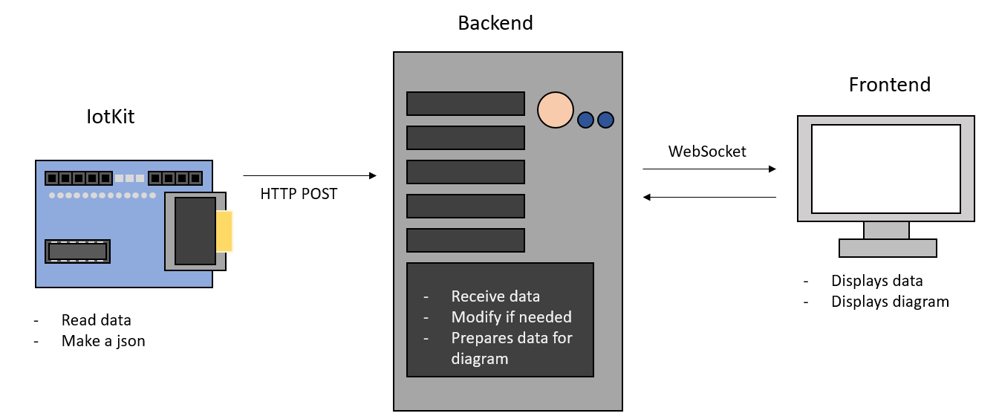

# Documentation Mbedstuff

In this documentation you are going to learn about our idea, how we did it and our thoughts.

## Idea

In M242 our goal is to learn about microchips, IoT and how to use the IoTKit V3.

Both team members hadn't had any major experience with this tool, so we learned alot of new things.
For LB02 we've decided to make something simple, but to use as many sensors as possible to learn about them.

Through the different repos offered by the teacher we grew our knowledge and tested new things.

Our idea was to read some data from some sensors and send it through the wlan to the backend, there the data is processed and later the data points are visualised.

## Sensors

In the end we decided to use 3 sensors and 1 button. Those are:

- DevI2C: Used for the gyro sensor
- HTS221Sensor: Used to measure the temperature and humidity
- DigitalIn: Used to count the presses on button 1
- OLEDDisplay: Used to display the data on the onboard display

### DevI2C
This is a gyro sensor, this can be used to measure many things.
For our program we use this sensor to count the times were rapid movement is committed.

### HTS221Sensor
We use this sensor to get the temerature and the humidity.

### DigitalIn
We use the onboard btn to count the taps.

### OLEDDisplay
The Iotkit also has a display, we use it to show the data we're getting.

## Systems

We use both frontend and backend, even if the frontend isn't that sophisticated.

### Frontend
We use html for the frontend, we also have JS that allows us to make graphs and diagrams for the datapoints.

### Backend
In the backend we use springboot, our server runs on a docker container.

## How to use
Our application is easy to use, you just need to clone the repo to mbedstudio and change the mbed_app.json file to your wlan connection.

### Setup mbed and iotkit

1. Change in wifi-ssid the value to your wlan name
2. Change in wifi-password the value to your wlan password.

That should be all that you have to change.

### Data
There are 4 datapoints we are receiving, those are:

- Temperature, datatype float
- Humidity, datatype float
- Buttonpress count, datatype integer
- Beat gyro sensors count, datatype integer.

We send this data every second once to the backend, the format looks like:

    [
        {
            "type": "SENSOR_TYPE",
            "value": "SENSOR_VALUE"
        },
        {
            "type": "SENSOR_TYPE",
            "value": "SENSOR_VALUE"
        }
    ]
This is the template:

When we send it, it looks like:

    [
        {
            "type": "TEMP",
            "value": "24.52"
        },
        {
            "type": "HUM",
            "value": "31.24"
        },
        {
            "type": "BEATC",
            "value": "1"
        },
        {
            "type": "BTNC",
            "value": "6"
        }
    ]

If you want this data to be sent to your backend you have to change the http link:

### Backend and Frontend

### Https
In this project we didn't use https, currently this is only running with http.

A reason why we didn't implement this was the time, we wanted to learn how to get data and then pass it, we didn't think
about using a secured connection, but if you want to use this here is how:

To use Https we have to use a certificate to authenticate the connection.

For mbed we have to import a library called https_request.h
    
        #include "https_request.h"

At the end we have to define a certificate, in the documentation it has something like this:

        const char SSL_CA_PEM[] =  "-----BEGIN CERTIFICATE-----\n"
    "MIIDQTCCAimgAwIBAgITBmyfz5m/jAo54vB4ikPmljZbyjANBgkqhkiG9w0BAQsF\n"
    "ADA5MQswCQYDVQQGEwJVUzEPMA0GA1UEChMGQW1hem9uMRkwFwYDVQQDExBBbWF6\n"
    "b24gUm9vdCBDQSAxMB4XDTE1MDUyNjAwMDAwMFoXDTM4MDExNzAwMDAwMFowOTEL\n"
    "MAkGA1UEBhMCVVMxDzANBgNVBAoTBkFtYXpvbjEZMBcGA1UEAxMQQW1hem9uIFJv\n"
    "b3QgQ0EgMTCCASIwDQYJKoZIhvcNAQEBBQADggEPADCCAQoCggEBALJ4gHHKeNXj\n"
    "ca9HgFB0fW7Y14h29Jlo91ghYPl0hAEvrAIthtOgQ3pOsqTQNroBvo3bSMgHFzZM\n"
    "9O6II8c+6zf1tRn4SWiw3te5djgdYZ6k/oI2peVKVuRF4fn9tBb6dNqcmzU5L/qw\n"
    "IFAGbHrQgLKm+a/sRxmPUDgH3KKHOVj4utWp+UhnMJbulHheb4mjUcAwhmahRWa6\n"
    "VOujw5H5SNz/0egwLX0tdHA114gk957EWW67c4cX8jJGKLhD+rcdqsq08p8kDi1L\n"
    "93FcXmn/6pUCyziKrlA4b9v7LWIbxcceVOF34GfID5yHI9Y/QCB/IIDEgEw+OyQm\n"
    "jgSubJrIqg0CAwEAAaNCMEAwDwYDVR0TAQH/BAUwAwEB/zAOBgNVHQ8BAf8EBAMC\n"
    "AYYwHQYDVR0OBBYEFIQYzIU07LwMlJQuCFmcx7IQTgoIMA0GCSqGSIb3DQEBCwUA\n"
    "A4IBAQCY8jdaQZChGsV2USggNiMOruYou6r4lK5IpDB/G/wkjUu0yKGX9rbxenDI\n"
    "U5PMCCjjmCXPI6T53iHTfIUJrU6adTrCC2qJeHZERxhlbI1Bjjt/msv0tadQ1wUs\n"
    "N+gDS63pYaACbvXy8MWy7Vu33PqUXHeeE6V/Uq2V8viTO96LXFvKWlJbYK8U90vv\n"
    "o/ufQJVtMVT8QtPHRh8jrdkPSHCa2XV4cdFyQzR1bldZwgJcJmApzyMZFo6IQ6XU\n"
    "5MsI+yMRQ+hDKXJioaldXgjUkK642M4UwtBV8ob2xJNDd2ZhwLnoQdeXeGADbkpy\n"
    "rqXRfboQnoZsG4q5WTP468SQvvG5\n"
    "-----END CERTIFICATE-----\n"
    "-----BEGIN CERTIFICATE-----\n"
    "MIIEkjCCA3qgAwIBAgIQCgFBQgAAAVOFc2oLheynCDANBgkqhkiG9w0BAQsFADA/\n"
    "MSQwIgYDVQQKExtEaWdpdGFsIFNpZ25hdHVyZSBUcnVzdCBDby4xFzAVBgNVBAMT\n"
    "DkRTVCBSb290IENBIFgzMB4XDTE2MDMxNzE2NDA0NloXDTIxMDMxNzE2NDA0Nlow\n"
    "SjELMAkGA1UEBhMCVVMxFjAUBgNVBAoTDUxldCdzIEVuY3J5cHQxIzAhBgNVBAMT\n"
    "GkxldCdzIEVuY3J5cHQgQXV0aG9yaXR5IFgzMIIBIjANBgkqhkiG9w0BAQEFAAOC\n"
    "AQ8AMIIBCgKCAQEAnNMM8FrlLke3cl03g7NoYzDq1zUmGSXhvb418XCSL7e4S0EF\n"
    "q6meNQhY7LEqxGiHC6PjdeTm86dicbp5gWAf15Gan/PQeGdxyGkOlZHP/uaZ6WA8\n"
    "SMx+yk13EiSdRxta67nsHjcAHJyse6cF6s5K671B5TaYucv9bTyWaN8jKkKQDIZ0\n"
    "Z8h/pZq4UmEUEz9l6YKHy9v6Dlb2honzhT+Xhq+w3Brvaw2VFn3EK6BlspkENnWA\n"
    "a6xK8xuQSXgvopZPKiAlKQTGdMDQMc2PMTiVFrqoM7hD8bEfwzB/onkxEz0tNvjj\n"
    "/PIzark5McWvxI0NHWQWM6r6hCm21AvA2H3DkwIDAQABo4IBfTCCAXkwEgYDVR0T\n"
    "AQH/BAgwBgEB/wIBADAOBgNVHQ8BAf8EBAMCAYYwfwYIKwYBBQUHAQEEczBxMDIG\n"
    "CCsGAQUFBzABhiZodHRwOi8vaXNyZy50cnVzdGlkLm9jc3AuaWRlbnRydXN0LmNv\n"
    "bTA7BggrBgEFBQcwAoYvaHR0cDovL2FwcHMuaWRlbnRydXN0LmNvbS9yb290cy9k\n"
    "c3Ryb290Y2F4My5wN2MwHwYDVR0jBBgwFoAUxKexpHsscfrb4UuQdf/EFWCFiRAw\n"
    "VAYDVR0gBE0wSzAIBgZngQwBAgEwPwYLKwYBBAGC3xMBAQEwMDAuBggrBgEFBQcC\n"
    "ARYiaHR0cDovL2Nwcy5yb290LXgxLmxldHNlbmNyeXB0Lm9yZzA8BgNVHR8ENTAz\n"
    "MDGgL6AthitodHRwOi8vY3JsLmlkZW50cnVzdC5jb20vRFNUUk9PVENBWDNDUkwu\n"
    "Y3JsMB0GA1UdDgQWBBSoSmpjBH3duubRObemRWXv86jsoTANBgkqhkiG9w0BAQsF\n"
    "AAOCAQEA3TPXEfNjWDjdGBX7CVW+dla5cEilaUcne8IkCJLxWh9KEik3JHRRHGJo\n"
    "uM2VcGfl96S8TihRzZvoroed6ti6WqEBmtzw3Wodatg+VyOeph4EYpr/1wXKtx8/\n"
    "wApIvJSwtmVi4MFU5aMqrSDE6ea73Mj2tcMyo5jMd6jmeWUHK8so/joWUoHOUgwu\n"
    "X4Po1QYz+3dszkDqMp4fklxBwXRsW10KXzPMTZ+sOPAveyxindmjkW8lGy+QsRlG\n"
    "PfZ+G6Z6h7mjem0Y+iWlkYcV4PIWL1iwBi8saCbGS5jN2p8M+X+Q7UNKEkROb3N6\n"
    "KOqkqm57TH2H3eDJAkSnh6/DNFu0Qg==\n"
    "-----END CERTIFICATE-----\n";

The rest is easy to change. 

Everywhere were "http" is written you just add an "s" and change it to "https".

    HttpRequest* post_req = new HttpRequest( network, HTTP_POST, "http://164.92.173.232:23552/api/sensor/data");
to
            
    HttpsRequest* post_req = new HttpsRequest( network, HTTP_POST, "https://164.92.173.232:23552/api/sensor/data");

# Reflexion

## Stefan A.

### What did I learn:
When I first started this course I had little knowledge about the iot world and the iot kit we are using,
I once already worked with arduino but some things were different. 

In the module I learned how to use multiple sensors and get data from the environment and one of the most important things
in my opinion how to send the data to the frontend via http requests, one thing is to get the data and the other to send it.

### Blocking points:
Everything went fairly smoothly, at the start we hadn't had any major problems, we just had to ask the internet a few times
for help, but those were little things.
The Problems began to pill up when we tried to use the http library and to send the data to the backend. The library used 
on the examples wasn't the same as the official, it might just be that the versioning was wrong. 

It took some time to figure out what's wrong and after a talk with the teacher the problem was resolved.

The second thing was also with the http request. We had to specify the header to be json, but we couldn't find a way. Same 
as the first problem, it was resolved after a talk with the teacher.

### What could I do better:
Our idea for the project wasn't very innovative, we didn't want to do something too big, in case we have problems we can't finish it.
I think it would be better to think of an idea and then add just a little bit more.

## Leon D.

### What did I learn:

### Blocking points:

### What could I do better:
